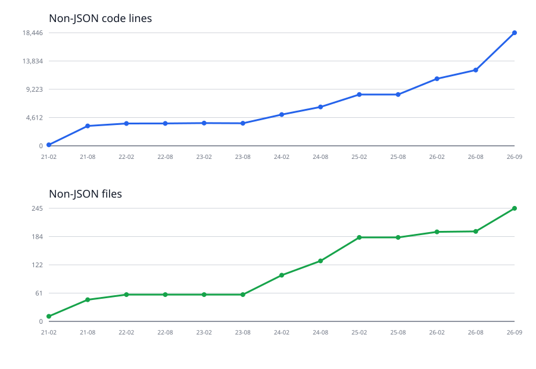

# Project Timeline: CFTracker

This timeline summarizes CFTracker’s development from its initial 2021 commit through the current `origin/main` snapshot. It combines notable recent milestones with reproducible six-month codebase measurements.

## Overview

CFTracker began as a React application for exploring Codeforces data and grew into a full-stack project with authentication, lists, statistics, a Go backend, automated verification, and contest-maintenance tooling.

## Project development highlights

- **2021 — Foundation:** Started as a Create React App project for browsing Codeforces contests and problems.
- **2022–2023 — Product expansion:** Added the main contest/problem workflows and expanded the stored Codeforces data model.
- **2024 — Full-stack transition:** Added authentication, user profiles, lists, statistics, PostgreSQL-backed services, and a Go backend while modernizing the frontend with Vite and React.
- **2025 — Product refinement:** Continued feature development, data updates, deployment work, and frontend/backend maintenance.
- **2026 — Quality and maintainability:** Added backend verification, repository and API coverage, migration checks, security fixes, and stronger CI conventions.

## Recent work: shared-contest MCP workflow

The latest major milestone, delivered across commits `20bc9e4` through `1a656e4` (2026-08-27 to 2026-09-02), introduced a tested MCP workflow for maintaining shared Codeforces contests. It added the MCP server and supporting services, hardened contest maintenance, automated Inspector coverage, and documented a simpler operator workflow through a reusable skill.

## Whole-project growth at six-month intervals

Each historical point uses the latest commit on `origin/main` available on or before the timestamp. The final “latest” point uses the current branch (`dev`) and `HEAD`. `cloc` was run against archived snapshots, excluding `.git`, `node_modules`, `dist`, `build`, and all `.json` files. “Code lines” means `cloc`’s `SUM.code` value. The source measurements are saved in [`docs/cloc-main-six-monthly.csv`](docs/cloc-main-six-monthly.csv).

Non-JSON files grew from 11 to 261 across the same snapshots. The charts show non-JSON code lines and file count; the complete measurements are below.
| Timestamp | Branch | Snapshot | Files | Code lines |
|---|---|---:|---:|---:|
| 2021-02-01 | main | `a450d15` | 11 | 162 |
| 2021-08-01 | main | `a3c2907` | 47 | 3,247 |
| 2022-02-01 | main | `0ceeb36` | 58 | 3,642 |
| 2022-08-01 | main | `731ee5b` | 58 | 3,651 |
| 2023-02-01 | main | `ed716c3` | 58 | 3,706 |
| 2023-08-01 | main | `3872091` | 58 | 3,683 |
| 2024-02-01 | main | `44efdba` | 100 | 5,100 |
| 2024-08-01 | main | `2bf42bb` | 131 | 6,338 |
| 2025-02-01 | main | `0ce7e5b` | 182 | 8,371 |
| 2025-08-01 | main | `f33f074` | 182 | 8,371 |
| 2026-02-01 | main | `3853b64` | 194 | 10,945 |
| 2026-08-01 | main | `9829286` | 195 | 12,355 |
| 2026-09-02 | main | `98b5f23` | 245 | 18,446 |
| 2026-09-03 (latest) | dev | `f1b9c62` | 261 | 21,106 |
