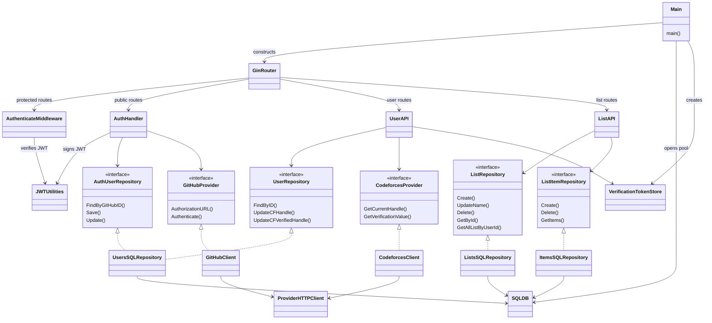
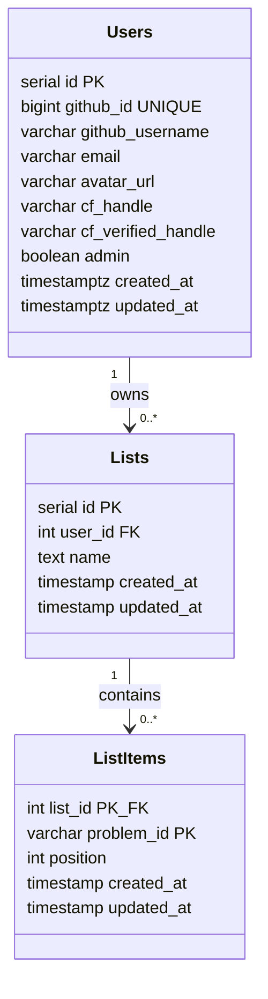

# Backend routes and request flows

This guide describes the backend as implemented in this checkout: its source paths, every registered HTTP route, data contracts, persistence rules, and the movement of requests between the frontend, API, PostgreSQL, GitHub, and Codeforces. The UML class and sequence diagrams use Mermaid and can be viewed in a Markdown viewer that supports Mermaid.

For configuration and running the service, see [README.md](README.md). For schema deployment and rollback, see [MIGRATION_FLOW.md](MIGRATION_FLOW.md). For verification commands and test database safety, see [TESTING.md](TESTING.md).

## Contents

- [Source paths and responsibilities](#source-paths-and-responsibilities)
- [Startup and dependencies](#startup-and-dependencies)
- [HTTP routes and contracts](#http-routes-and-contracts)
- [GitHub authentication flow](#github-authentication-flow)
- [Protected request flow](#protected-request-flow)
- [Codeforces ownership flow](#codeforces-ownership-flow)
- [Handle changes and concurrent requests](#handle-changes-and-concurrent-requests)
- [List and item flow](#list-and-item-flow)
- [Database model](#database-model)
- [Deployment and state lifetime](#deployment-and-state-lifetime)
- [Code navigation and maintenance](#code-navigation-and-maintenance)

## Source paths and responsibilities

Paths in this table are relative to `backend/` unless they start with `../`.

| Path | Responsibility |
| --- | --- |
| [`cmd/api/main.go`](cmd/api/main.go) | Application entry point; constructs dependencies, middleware, routes, and HTTP listener. |
| [`configs/configs.go`](configs/configs.go) | Loads environment and optional `.env`, validates required settings, parses CORS origins and provider timeout. |
| [`internal/db/db.go`](internal/db/db.go) | Opens PostgreSQL, configures the connection pool, and checks connectivity. |
| [`internal/routes/routes.go`](internal/routes/routes.go) | Registers the auth, user, and list route groups. |
| [`internal/middlewares/auth.go`](internal/middlewares/auth.go) | Checks the bearer JWT and stores the verified `int64 userId` in the Gin context. |
| [`internal/utils/jwt.go`](internal/utils/jwt.go) | Signs and verifies HS256 JWTs. |
| [`internal/auth/auth_routes.go`](internal/auth/auth_routes.go) | Public GitHub login and callback routes, including compatibility aliases. |
| [`internal/auth/auth_handlers.go`](internal/auth/auth_handlers.go) | OAuth state cookie, GitHub login, user creation/profile refresh, JWT response. |
| [`internal/auth/auth_configs.go`](internal/auth/auth_configs.go) | GitHub OAuth configuration and `user:email` scope. |
| [`internal/auth/github_provider.go`](internal/auth/github_provider.go) | Exchanges the code and fetches GitHub `/user` through a bounded HTTP request. |
| [`internal/users/users_routes.go`](internal/users/users_routes.go) | Protected profile and Codeforces routes. |
| [`internal/users/users_handler.go`](internal/users/users_handler.go) | Profile lookup, handle selection, challenge generation, verification, and HTTP error mapping. |
| [`internal/users/users_model.go`](internal/users/users_model.go) | User JSON model and verification derived from the two handles. |
| [`internal/users/users_repository.go`](internal/users/users_repository.go) | User SQL and conditional Codeforces writes. Also exposes internal admin/list-all methods without HTTP routes. |
| [`internal/users/users_cfverification.go`](internal/users/users_cfverification.go) | Mutex-protected, expiring in-memory challenge store. |
| [`internal/users/codeforces_provider.go`](internal/users/codeforces_provider.go) | Codeforces `user.info`, historical handle resolution, and reading `firstName` for proof. |
| [`internal/lists/lists_routes.go`](internal/lists/lists_routes.go) | Protected list and item routes. |
| [`internal/lists/lists_handler.go`](internal/lists/lists_handler.go) | HTTP validation, authenticated owner ID, response shapes, and repository error mapping. |
| [`internal/lists/lists_repository.go`](internal/lists/lists_repository.go) | List SQL, always scoped to the authenticated owner. |
| [`internal/lists/items/list_items_repository.go`](internal/lists/items/list_items_repository.go) | Item SQL with list ownership checks; contains an internal reorder method with no registered route. |
| [`internal/lists/lists_model.go`](internal/lists/lists_model.go), [`internal/lists/items/list_items_model.go`](internal/lists/items/list_items_model.go) | List and item response models. |
| [`migrations/`](migrations/) | Versioned application schema and migration metadata. |
| [`cmd/migration-check/main.go`](cmd/migration-check/main.go), [`cmd/migration-target/main.go`](cmd/migration-target/main.go) | Migration checksum validation and table rollback target lookup. |
| [`Makefile`](Makefile), [`scripts/`](scripts/) | Build, tests, migration commands, and schema comparison. |
| [`tests/unit/`](tests/unit/), [`tests/integration/`](tests/integration/) | Unit suites, PostgreSQL integration suites, and migration lifecycle checks. |
| [`tests/support/`](tests/support/) | Test-only HTTP, provider, and disposable PostgreSQL helpers. |
| [`dockerfile`](dockerfile), [`.env.example`](.env.example) | Container build and configuration template. |
| [`../src/data/queries/baseQuery.ts`](../src/data/queries/baseQuery.ts) | Frontend API base URL, credentialed requests, and bearer header. |
| [`../src/data/queries/userQuery.ts`](../src/data/queries/userQuery.ts), [`../src/hooks/useUser.ts`](../src/hooks/useUser.ts) | Frontend callback request, response conversion, and authentication state. |
| [`../src/data/queries/listQuery.ts`](../src/data/queries/listQuery.ts) | Frontend list requests, response conversion, cache invalidation, and item sorting. |

## Startup and dependencies

The application performs these steps in `main()`:

1. Load configuration. Existing process environment takes precedence over `.env`; invalid required settings stop startup.
2. Initialize the JWT signing secret.
3. Open PostgreSQL and ping it with a five-second deadline. The pool allows up to ten open and five idle connections. Failure stops startup.
4. Construct the shared provider HTTP client and GitHub/Codeforces providers using `EXTERNAL_API_TIMEOUT` (default ten seconds).
5. Construct repositories from the database connection, then handlers from their repository/provider interfaces. Create one Codeforces token store for this process.
6. Create Gin with request logging and panic recovery, install CORS, and register all routes.
7. Listen on `:<PORT>` (default `8080`). The API listener is HTTP; a hosting reverse proxy can terminate TLS.

Startup does **not** apply migrations or verify that the schema is current. Run the migration deployment step before starting the API.

### UML dependency diagram

The handler-to-interface arrows show the injected boundaries. Concrete repositories share one `sql.DB` pool; providers share an HTTP client. Repository names are qualified here to distinguish the three Go types named `Repository`.



## HTTP routes and contracts

The canonical prefix is `/api`. Only the two GitHub routes also have aliases without that prefix. `/user/...` and `/lists/...` without `/api` are not registered. `/` returns `404`; there is no health-check endpoint.

Protected requests require `Authorization: Bearer <JWT>`. Send `Content-Type: application/json` with JSON bodies. Errors from application handlers use `{"error":"message"}`; success messages use `{"message":"message"}`. Gin's default unregistered-route response and middleware responses such as CORS rejection do not necessarily use this JSON envelope.

### Public authentication routes

| Method and path | Input | Success | Failure |
| --- | --- | --- | --- |
| `GET /api/auth/github/login` | No body. Browser navigation. | `307` redirect to GitHub; sets OAuth state cookie. | `500` if state generation fails. |
| `GET /api/auth/github/callback` | Query `code` and `state`; matching state cookie. | `200 {"user": User, "token": "JWT"}` | `400` invalid/missing state; `500` token exchange, user fetch/decode, persistence, or JWT generation failure; `502` rejected GitHub user response. |

Aliases: `GET /auth/github/login` and `GET /auth/github/callback` have identical behavior.

### Protected user routes

All four routes can return `401 {"error":"Unauthorized"}` before the handler runs, `404 {"error":"User not found"}` when the database user is absent, or `500 {"error":"Failed to load user"}` when a user read fails.

| Method and path | Input | Success | Additional failures |
| --- | --- | --- | --- |
| `GET /api/user/profile` | None | `200 {"user": User}` | No additional handler-specific errors. |
| `PUT /api/user/cfhandle` | `{"cf_handle":"tourist"}` | `200 {"message":"CF Handle updated"}` | `400` invalid body/handle; `409` stale handles; `500` database write; provider errors below. |
| `GET /api/user/cfverification-token` | None; selected handle is read from the database. | `200 {"token":"9-character challenge"}` | `400` already verified; `500` token generation failure. |
| `GET /api/user/verify-cftoken` | None; reads the challenge and selected handle server-side. | `200 {"message":"User verified"}` | `400` already verified or invalid/expired/missing token; `409` stale handles; `500` database write; provider errors below. |

Handle input is required, limited to 255 characters by binding validation, then trimmed; whitespace-only values and semicolons are rejected. With no stored proof, selecting a handle does not call Codeforces or establish that the account exists. The challenge endpoint currently does not reject an empty selected handle; clients should select a handle first.

Codeforces provider errors map to these responses on either historical lookup or ownership verification:

| Condition detected by the provider | HTTP status and message |
| --- | --- |
| Request construction failed | `500`, `Failed to make request object` |
| Transport failure or timeout | `500`, `Failed to make request to CF` |
| HTTP response other than `200` | `502`, `Codeforces request failed` |
| Invalid JSON, non-OK API status, invalid result count/handle, or mismatched handle during proof | `502`, `Error parsing CF response` |
| Successful OK payload with an empty result array | `400`, `Codeforces user not found` |

These mappings describe backend behavior; a nonexistent account may produce a different mapping depending on the upstream response format.

### Protected list routes

Every route requires a JWT. For list-specific operations, a missing list and a list owned by someone else both return `404 {"error":"List does not exist"}`. Database failures return `500` with an operation-specific message. Invalid numeric `listId` parameters return `400 {"error":"Invalid list Id"}`.

| Method and path | Input | Success |
| --- | --- | --- |
| `GET /api/lists` | None | `200 {"message":"Lists fetched successfully", "lists": List[]}` |
| `POST /api/lists` | `{"name":"Practice"}` | `201 {"message":"List created", "list": List}` |
| `GET /api/lists/:listId` | List ID | `200 {"message":"List fetched successfully", "list": List, "items": ListItem[]}` |
| `PUT /api/lists/:listId` | `{"name":"Updated name"}` | `200 {"message":"List name updated"}` |
| `DELETE /api/lists/:listId` | List ID | `200 {"message":"List deleted"}` |
| `PUT /api/lists/:listId/item` | `{"problem_id":"1900A", "position":0}` | `201 {"message":"Successfully added item to list", "item": ListItem}` |
| `DELETE /api/lists/:listId/item/:itemId` | `itemId` is the problem ID string, **not** a numeric row ID. | `200 {"message":"Item deleted from list"}` |

Names are required and trimmed; empty names return `400 {"error":"Invalid format"}`. Adding an item requires a nonempty trimmed `problem_id` (binding maximum 100 characters) and an explicitly supplied integer `position >= 0`; invalid bodies return the same `400`. URL-encode problem IDs when constructing item paths.

An item PUT inserts a row; it is not an upsert. Duplicate `(list_id, problem_id)` or duplicate `(user_id, name)` constraints currently become generic `500` operation failures, not `409`. Removing an absent item from an existing owned list succeeds. There is no registered reorder route, pagination, list-count limit, problem metadata lookup, or Codeforces ownership requirement for using lists. List IDs are parsed as signed 64-bit integers; zero/negative IDs normally reach the repository and produce `404`.

### JSON models

`User` in callback and profile responses:

```json
{
  "id": 7,
  "github_id": 42,
  "github_username": "octocat",
  "email": "user@example.test",
  "avatar_url": "https://example.test/avatar.png",
  "cf_handle": "tourist",
  "cf_verified_handle": "tourist",
  "admin": false
}
```

There is no `cf_verified` field. A new account has empty Codeforces handles. The API does not expose the user's database timestamps. GitHub's `/user` email may be empty; the provider does not make a separate `/user/emails` request. The frontend converts snake_case fields to camelCase, including `cfVerifiedHandle`, and stores the returned JWT as `jwtToken` in authentication state.

`List` and `ListItem`:

```json
{
  "list": {"id": 12, "user_id": 7, "name": "Practice", "created_at": "2026-10-09T12:00:00Z"},
  "item": {"list_id": 12, "problem_id": "1900A", "position": 0, "created_at": "2026-10-09T12:01:00Z"}
}
```

This example shows the two model shapes together, not a single endpoint response. Empty collections are `[]`. The API SQL does not guarantee list/item ordering. The frontend sorts items by position, then creation timestamp, then problem ID.

## GitHub authentication flow

`GITHUB_REDIRECT_URL` points to the frontend callback page (locally `/callback/auth-gh`), rather than directly to the backend callback handler. That page forwards the query parameters to the API using a credentialed request so the state cookie accompanies it.

```mermaid
sequenceDiagram
    actor User
    participant Browser as Browser / frontend
    participant Auth as AuthHandler
    participant GitHub as GitHub OAuth / API
    participant Repo as Users repository
    participant DB as PostgreSQL
    User->>Browser: Choose GitHub login
    Browser->>Auth: GET /api/auth/github/login
    Auth-->>Browser: Set HttpOnly state cookie; 307 to GitHub
    Browser->>GitHub: Authorize with state and redirect URI
    GitHub-->>Browser: Redirect to frontend callback with code and state
    Browser->>Auth: GET /api/auth/github/callback?code=...&state=... plus cookie
    Auth->>Auth: Compare state in constant time
    alt State absent or mismatched
        Auth-->>Browser: 400 Invalid GitHub OAuth state
    else State valid
        Auth->>Auth: Clear state cookie
        Auth->>GitHub: Exchange code for GitHub access token
        GitHub-->>Auth: Access token
        Auth->>GitHub: GET /user with access token
        GitHub-->>Auth: GitHub ID, login, email, avatar
        Auth->>Repo: FindByGitHubID
        Repo->>DB: SELECT user by github_id
        DB-->>Repo: User or no row
        Repo-->>Auth: Lookup result
        alt First login
            Auth->>Repo: Save new user
            Repo->>DB: INSERT user, RETURNING id
        else Existing user
            Auth->>Repo: Update GitHub profile fields
            Repo->>DB: UPDATE username, email, avatar only
        end
        DB-->>Repo: Saved user ID
        Repo-->>Auth: Success
        Auth->>Auth: Sign two-hour HS256 JWT
        Auth-->>Browser: 200 user and JWT
        Browser->>Browser: Convert fields; store authentication state and JWT
    end
```

The state cookie lasts ten minutes. It uses `HttpOnly` and path `/`; HTTPS requests (including `X-Forwarded-Proto: https`) use `Secure` and `SameSite=None`, while HTTP uses `SameSite=Lax`. A new login replaces the pending state for that browser. A valid state is consumed before contacting GitHub, so a later failure requires starting login again. The GitHub access token is used by the provider and is not saved in the application database or returned to the frontend.

The app JWT contains `email`, `userId`, and a two-hour expiry. Protected handlers derive identity from the signed `userId`, not from user IDs supplied in a request body. Existing-user login updates only GitHub profile fields and preserves Codeforces handles and admin status. There are no refresh-token, server-side logout, or token-revocation routes; frontend logout removes its local session, and an issued JWT remains usable until expiry or a signing-secret change.

## Protected request flow

```mermaid
sequenceDiagram
    participant Client
    participant Gin as Gin / CORS
    participant Auth as Authenticate middleware
    participant Handler
    participant Repo as Repository
    participant DB as PostgreSQL
    Client->>Gin: Request with Authorization Bearer JWT
    Gin->>Auth: Allowed request to a protected route
    Auth->>Auth: Verify HS256 signature, expiry, integer userId
    alt Missing or invalid bearer token
        Auth-->>Client: 401 Unauthorized; abort handler
    else Valid token
        Auth->>Handler: Continue with context.userId
        Handler->>Handler: Validate route parameters and JSON
    Handler->>Repo: Operation with request context and authenticated identity
    Repo->>Repo: Derive DATABASE_TIMEOUT budget; defer cancel
    Repo->>DB: Context-aware SQL with ownership or stale-state guards
        DB-->>Repo: Rows or error
        Repo-->>Handler: Model or domain error
        Handler-->>Client: JSON success or mapped error
    end
```

CORS applies globally. It allows configured browser origins and credentials, including the `Authorization` header. Requests without an `Origin` header can still be sent by direct API clients; CORS is not authentication. Providers receive the request context and add their own timeout. Every application repository method also receives that request context and derives a `DATABASE_TIMEOUT` budget (default five seconds). SQL uses `QueryContext`, `QueryRowContext`, `ExecContext`, and `BeginTx`, including transaction queries. Pool acquisition, SQL execution, row iteration, and multi-query operations share the operation's budget. A canceled request or earlier parent deadline stops database work sooner. `GetItems` delegates to `GetListItems`, which owns their shared budget. Migration commands run separately and are outside this HTTP cancellation policy.

The database timeout applies per repository operation, not to the entire request. A route with multiple database operations or external provider calls can take longer overall. Existing error mapping returns operation-specific HTTP `500` responses for database timeouts; cancellation may leave no connected client to receive a response. A failed/canceled transaction is rolled back. For writes, a network failure near completion can leave the client uncertain whether a commit succeeded; a timeout response is not a guarantee that every write was undone. See [README.md](README.md#configuration) for configuration and tuning guidance.

## Codeforces ownership flow

The selected account is `cf_handle`; ownership proof is stored as `cf_verified_handle`. `User.IsCFVerified()` is true only when the selected handle is nonempty and equals the verified handle ignoring case. The boolean is computed when needed and is neither persisted nor included in JSON.

| Selected handle | Verified handle | Meaning |
| --- | --- | --- |
| Empty | Empty | No selected account or proof. |
| `Petr` | Empty | Selected account needs verification. |
| `tourist` | `Tourist` | Selected account is verified; case does not matter. |
| `Petr` | `tourist` | Old ownership proof remains; selected account is unverified. |

```mermaid
sequenceDiagram
    actor User
    participant Client
    participant API as User API
    participant DB as PostgreSQL via users repository
    participant Tokens as In-memory token store
    participant CF as Codeforces
    Client->>API: PUT /api/user/cfhandle with selected handle
    API->>DB: Read user; conditionally save selected handle
    DB-->>API: Success
    API-->>Client: 200 CF Handle updated
    Client->>API: GET /api/user/cfverification-token
    API->>DB: Read selected and verified handles
    DB-->>API: Unverified user
    API->>Tokens: Get token for user ID and lowercase handle
    alt No unexpired token
        API->>Tokens: Store new nine-character token for one hour
    end
    Tokens-->>API: Challenge token
    API-->>Client: 200 token
    Client-->>User: Ask user to set Codeforces firstName to token
    User->>CF: Update Settings / Social / First name
    Client->>API: GET /api/user/verify-cftoken
    API->>DB: Read current selected and verified handles
    DB-->>API: User snapshot
    API->>CF: user.info selected handle, checkHistoricHandles=false
    CF-->>API: Handle and firstName
    API->>Tokens: Get unexpired token for snapshot user and handle
    Tokens-->>API: Stored token or missing
    alt Missing, expired, or firstName differs
        API-->>Client: 400 Invalid token
    else Token matches
        API->>DB: Set verified handle if both snapshot handles still match
        alt Snapshot no longer matches
            DB-->>API: No row updated
            API-->>Client: 409 Codeforces handle changed; please retry
        else Conditional update succeeds
            DB-->>API: Updated user
            API->>Tokens: Delete token for this user and handle
            API-->>Client: 200 User verified
        end
    end
```

This sequence shows first-time verification. Already verified users receive `400` from either challenge endpoint. The provider also checks that the returned current handle equals the selected handle ignoring case; historic aliases are deliberately disabled for this ownership challenge. The stored token is compared with Codeforces `firstName` exactly. A profile read after success returns the updated verified handle; the mutation response itself contains only a message.

Tokens are keyed by both user ID and lowercase handle, so another user's token or another selected handle does not supply proof. Repeated token requests reuse an unexpired token. Expiration is checked on access, with no background cleanup worker. Changing handles does not delete old tokens, but those tokens cannot verify a different selected handle.

## Handle changes and concurrent requests

A user can change the selected handle without discarding their previous ownership proof. When the requested handle differs from a nonempty stored verified handle, the API resolves the verified account's current handle using history. This detects a renamed CF account.

```mermaid
sequenceDiagram
    participant Client
    participant API as User API
    participant CF as Codeforces
    participant DB as PostgreSQL via users repository
    Client->>API: PUT /api/user/cfhandle with requested handle
    API->>DB: Read selected and verified handle snapshot
    DB-->>API: User snapshot
    alt Verified handle exists and differs from requested handle
        API->>CF: user.info stored verified handle, checkHistoricHandles=true
        alt Provider lookup fails
            CF-->>API: Error
            API-->>Client: Mapped error; no database write
        else Lookup succeeds
            CF-->>API: Current canonical handle
            alt Canonical handle equals requested handle ignoring case
                API->>API: Set selected and verified handles to canonical handle
            else Requested handle is a different account
                API->>API: Set selected handle; preserve old verified handle
            end
        end
    else No proof or requested handle already matches proof
        API->>API: Set selected handle; preserve verified handle
    end
    opt Validation and any required lookup succeeded
        API->>DB: UPDATE only if both old handles still match
        alt Concurrent change made snapshot stale
            DB-->>API: No row updated
            API-->>Client: 409 Codeforces handle changed; please retry
        else Write succeeds
            DB-->>API: Updated user
            API-->>Client: 200 CF Handle updated
        end
    end
```

Both handle selection and successful challenge verification use a single conditional SQL update. Its predicates include user ID, the previously read selected handle (`COALESCE(cf_handle, '')`), and the previously read verified handle. These SQL comparisons are exact; logical ownership comparisons in Go ignore case. If a concurrent request changes either stored handle before the write, the update matches no row and maps to `409`. The client should reload the profile and retry against current state. There is no version column, and the check compares current values rather than recording every intermediate change.

Selecting a different account requires a new token challenge. Selecting the same verified handle (ignoring case) skips the historical lookup. Historical lookup only occurs during a qualifying handle-change request; there is no scheduled job that discovers renamed accounts automatically. Failed lookups preserve both stored handles. The backend uses Codeforces handle history as the basis for retaining proof; it does not store a separate immutable Codeforces account ID.

## List and item flow

List operations do not call GitHub or Codeforces. JWT authentication identifies the owner, handlers validate input, and repository SQL enforces ownership again.

```mermaid
sequenceDiagram
    participant Client
    participant Auth as JWT middleware
    participant API as List API
    participant Lists as Lists repository
    participant Items as Items repository
    participant DB as PostgreSQL
    Client->>Auth: PUT /api/lists/12/item with problem_id and position
    Auth->>API: Authenticated userId
    API->>API: Parse listId; validate item JSON
    API->>Items: Create(userId, item)
    Items->>DB: INSERT SELECT FROM lists WHERE id=12 AND user_id=userId
    alt List absent or belongs to someone else
        DB-->>Items: No inserted row
        Items-->>API: ErrListNotFound
        API-->>Client: 404 List does not exist
    else Owned list
        DB-->>Items: Inserted item timestamp
        Items-->>API: Item
        API-->>Client: 201 item and message
    end
    Client->>Auth: GET /api/lists/12
    Auth->>API: Authenticated userId
    API->>Lists: GetById(userId, 12)
    Lists->>DB: SELECT list WHERE id=12 AND user_id=userId
    DB-->>Lists: Owned list
    Lists-->>API: List
    API->>Items: GetItems(userId, 12)
    Items->>DB: LEFT JOIN lists and items with owner predicate
    DB-->>Items: Item rows, or owned empty-list row
    Items-->>API: Items array
    API-->>Client: 200 list, items, and message
```

List rename/delete/read predicates include both `id` and `user_id`; fetching all lists filters by `user_id`. Item insertion selects from an owned list; item deletion joins the owning list; item reads use an owner-scoped left join so an empty owned list returns `[]` while an inaccessible list returns `404`. Deleting a list cascades to its items in PostgreSQL.

The list-with-items response uses two separate reads, not a transaction or a guaranteed consistent snapshot. Item positions are supplied by the client and are not unique. Inserting/deleting an item does not shift other positions. The internal `ReorderListItems` method uses a transaction and locks the owned list, but no HTTP handler exposes it. Frontend mutations invalidate the relevant RTK Query cache tags, causing active queries to refresh.

## Database model

### UML data model

The classes below represent database tables, not the narrower HTTP models. A list has one owning user; an item has one list. Both foreign keys use `ON DELETE CASCADE`.



| Migration | Result |
| --- | --- |
| `000001_add_migration_checksums` | Migration metadata schema/functions and checksum tracking. |
| `000002_create_users` | Users, unique GitHub ID, verified-handle default `''`, and automatic user `updated_at` trigger. |
| `000003_create_lists` | User-owned lists; unique `(user_id, name)`; cascading user foreign key. |
| `000004_create_list_items` | Composite primary key `(list_id, problem_id)`; cascading list foreign key. |

The expected current application migration version is `4`. Migration state is tracked in `schema_migrations`; table rollback targets and file checksums are in `migration_meta`. List and item timestamps have defaults but no automatic update trigger; user updates do have that trigger. There is no problems table, stored provider access token, persisted challenge token, or persisted verification boolean.

The verified-handle schema is folded into migration 2 for the explicitly disposable backend database. A database created from the previous migration history needs the separately agreed recreation procedure; do not apply that assumption to the main application database or to future production data. Once this history is deployed/shared, follow the immutable migration workflow described in [MIGRATION_FLOW.md](MIGRATION_FLOW.md).

## Deployment and state lifetime

The intended hosting request path is browser/frontend → HTTPS reverse proxy → one Go API process → PostgreSQL or external provider. The reverse proxy is deployment infrastructure, not code provided by this backend.

| State or dependency | Location / lifetime | Operational consequence |
| --- | --- | --- |
| Users, ownership proof, lists, items | PostgreSQL | Survives API restart; requires the migrated schema and persistent database storage. |
| Pending CF challenges | API process memory, one-hour validity | Restart loses pending challenges; request a new token afterward. Use shared storage before running multiple API instances. |
| OAuth state | Browser HttpOnly cookie, ten minutes | Callback requires the same browser cookie. Cross-origin requests include credentials; browser cookie policies still apply. |
| App JWT | Returned to client, two-hour expiry | Restart with the same secret preserves JWT validity. Expired tokens require login again. |
| JWT and GitHub secrets | Injected process environment or local `.env` | Required at startup; keep production configuration outside the image/repository. |
| Provider calls | Outbound HTTPS to GitHub and Codeforces | Require network egress, CA certificates, and the configured timeout. |
| PostgreSQL pool | Per-process `sql.DB` | At most ten open connections per API process; application repository operations inherit request cancellation and a five-second default timeout, including pool waits. |

For deployment, apply migrations separately, inject the README's required environment variables, set the frontend API base URL to the reachable API `/api` prefix, configure the exact frontend CORS origin, and register the frontend callback URL in GitHub OAuth settings. Forward `X-Forwarded-Proto: https` from the HTTPS proxy for secure OAuth cookies. The proxy should control that forwarded header. The container exposes port 8080 by default; changing `PORT` also requires matching hosting port configuration.

The service currently has no dedicated readiness/liveness route, refresh/revocation API, application rate limiter, background worker, or explicit graceful-shutdown sequence. `gin.Default()` supplies logging/recovery, while `router.Run()` uses the standard server defaults without application-configured read/write/idle timeouts. These are current implementation boundaries, not features supplied by the diagrams. Consult the hosting provider's proxy/process settings when deploying; this guide does not provision infrastructure.

## Code navigation and maintenance

To trace a route, start in its `*_routes.go`, follow the handler, then its injected repository/provider interface. Repository implementations contain the SQL and domain errors; handler helpers map those errors to HTTP responses. Providers contain external URLs, response decoding, and timeout handling. `cmd/api/main.go` shows which concrete implementations are wired together.

For changes, update the route contract and relevant sequence here, implementation tests alongside the affected package, and integration tests when SQL or ownership behavior changes. Unit suites mock repository/provider boundaries; integration suites exercise real PostgreSQL and complete routed workflows with controlled providers. Use [TESTING.md](TESTING.md) for commands and safety requirements. Documentation changes alone do not require starting the API, contacting external providers, or modifying any database.
